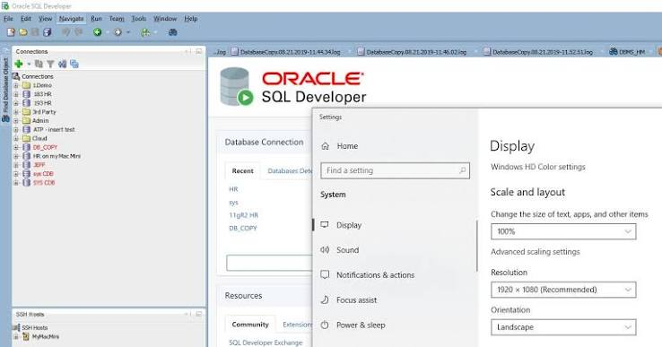
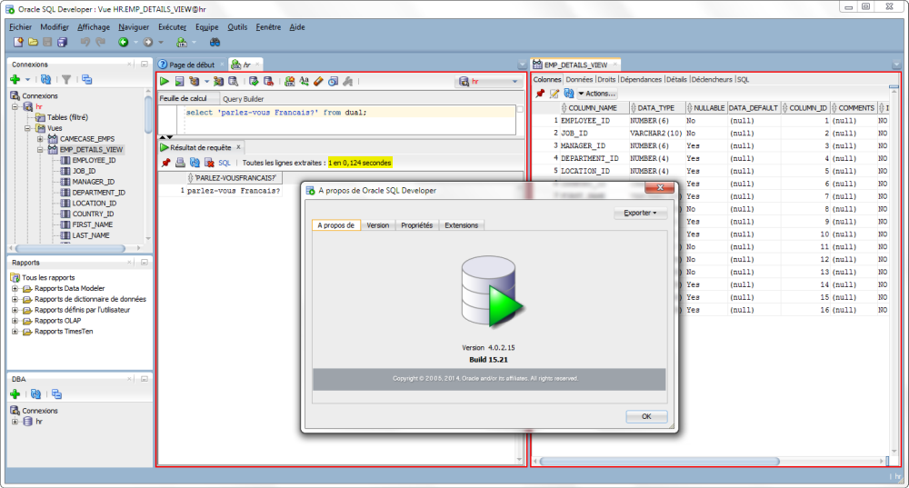
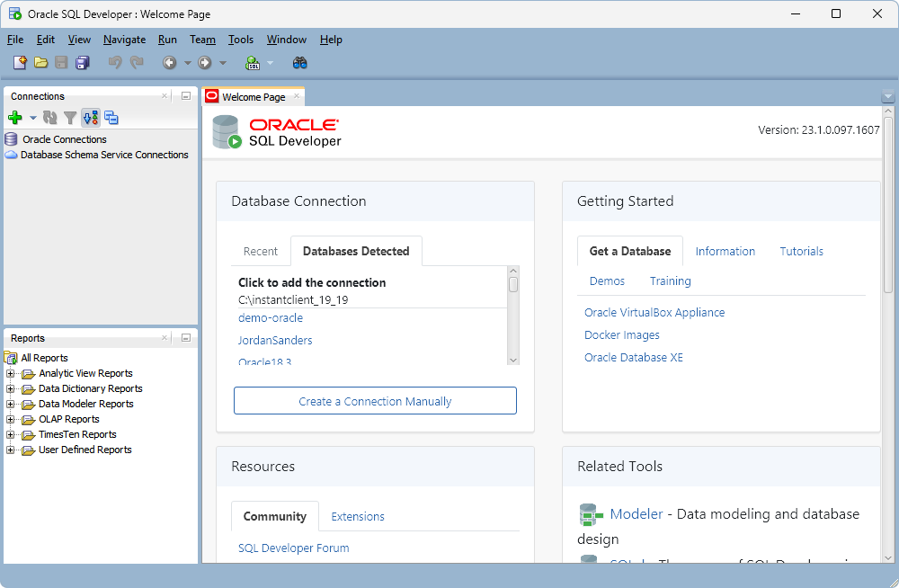

# Oracle Sql De

Oracle Sql De is the free desktop workspace for Oracle Database. You browse schemas, run SQL, and compile PL/SQL without standing up a separate admin console. Plsql Developer habits fit here: a worksheet, a debugger, and a tree of objects on one screen.

The same product family also covers oracle sql developer online in the browser, and oracle sql developer data modeler when the job is an ER diagram rather than a query. installing oracle sql developer is a zip you unpack. On Windows the usual bundle already contains a JDK.



People shorten the name in search boxes. The window title still says Oracle SQL Developer. This page uses both, because that is how the download and the daily work are actually named.

## Features

The desktop IDE is a Java application. It does not need an Oracle client install for a normal connection. You point it at a host, a port, and a service name, then open a worksheet.

### Connections and authentication

connecting sql developer to oracle database starts with a named connection. Store the host, port, service or SID, and the user. Passwords can stay in the local password store. A wallet file is the path into Autonomous Database and other cloud services that expect mutual TLS.

oracle sql developer local database is the same dialog pointed at localhost. oracle sql developer xe uses that form against Express Edition. oracle sql developer for oracle 19c is not a separate product. You pick a connection that speaks to that server. The IDE tracks several connections, so a laptop database and a shared server can sit side by side.

oracle sql developer connect to oracle cloud and oracle sql developer connect to autonomous database reuse the connection dialog. You are not switching apps. You are switching the endpoint.

### Schema browser

The tree lists tables, views, indexes, sequences, procedures, packages, triggers, and types. Open an object for columns, keys, and the DDL that would recreate it. Filters keep system schemas out of the way when you only care about the application owner.

oracle sql developer generate ddl reads that metadata and writes a script. oracle sql developer database diff compares two connections and shows what the target is missing. Use that before you promote a change, not after the job has already failed.

A useful pass over a new schema checks four things:

- Tables you expect are under the right owner.
- Primary keys and foreign keys match the diagram.
- Indexes exist on the columns the worksheet filters.
- Procedures compile without a leftover invalid object.

If a name is missing, confirm the user you connected as. A connection to SYS sees a different tree than a connection to the application owner. Switch the user before you decide the object was never created.

### SQL editor

oracle sql developer sql worksheet is the editor. Ctrl+Enter runs the statement under the cursor and returns a grid. F5 runs the buffer as a script and streams text. Pin a result if you need to compare it with the next run. oracle sql developer explain plan shows cost and the steps the optimizer chose.

oracle sql developer export query results to excel, or to CSV, comes from the grid. oracle sql developer import csv walks the other direction: map columns, then load. oracle sql developer show line numbers is a preference, useful when a compiler error cites a line. oracle sql developer intellisense offers tables and columns from the connection you have open. oracle sql developer dark mode is a theme switch, not a second download.

```
SELECT department_id, COUNT(*) AS people
FROM employees
GROUP BY department_id
ORDER BY people DESC;
```

### PL/SQL features

oracle sql developer pl sql debugger steps through procedures, functions, packages, and triggers. Set a breakpoint, watch a variable, and read DBMS_OUTPUT without leaving the IDE. Compile errors land on the line the server reported.

A package body and its spec stay as separate nodes in the tree. Edit, compile, and run a small anonymous block when you only need to call one procedure. That is the loop most PL/SQL work actually is.

### Data modeler and migration

oracle sql developer data modeler draws an ER diagram from a live schema or from a design you draw first. Forward engineering emits DDL. Reverse engineering reads an existing user and builds the picture. oracle sql developer er diagram is that picture, saved with the design, not a one-off screenshot.

oracle sql developer migration moves a third-party database toward Oracle. mysql to oracle migration using sql developer and db2 to oracle migration using sql developer are assistants in that area, as is oracle sql developer migrate sql server to oracle. They map types and emit scripts. They do not promise a silent conversion of every stored procedure. Read the report before you load the result into production.

| Term | In this app |
| --- | --- |
| Worksheet | The SQL editor and its result grid |
| Connection | A saved endpoint, user, and service |
| Explain plan | The optimizer steps for a statement |
| Modeler | The ER design tool and its DDL |
| Dump or cart | A portable set of objects or rows |
| SQLcl | The command-line cousin of the IDE |



## What it is

This is a desktop IDE for one database family. It is not a hosted notebook, and it is not a generic client for every engine on earth. The files you edit can live in git. oracle sql developer git integration is available when you want the worksheet tree to follow a repository. The database itself is still the source of procedures that have been compiled on the server.

What you get on a normal day:

- A connection list for local, network, and cloud databases.
- A worksheet with grid output and script output.
- A PL/SQL editor and debugger.
- A data modeler for diagrams and DDL.
- Wizards for CSV, Excel, and third-party migration.
- A preferences panel for JDK path, fonts, and theme.

What it will not do is administer the operating system or replace a backup tool. Export the data you care about. Do not treat an unsaved worksheet as a backup.

## Screenshots

The first screen is the connection list. After you connect, the left tree is the schema and the center is the worksheet. A result grid opens under the statement you ran. The modeler is a separate window of entities and relations.



If the layout feels cramped, close the panels you are not using. Line numbers, font size, and the dark theme are all preferences. They survive the next launch.

## Architecture

The desktop shell is Java. The database connection uses JDBC. A query you run is sent to the server. The grid is only a view of what came back. PL/SQL you compile is stored in the database, not only in the local file.

| Edition | Where it runs | Use it for |
| --- | --- | --- |
| Classic desktop | Windows, macOS, Linux | Worksheet, debugger, modeler |
| VS Code extension | The editor you already use | The same SQL and PL/SQL flow |
| Browser tools | Autonomous Database and ORDS | oracle sql developer online |
| SQLcl | A terminal | Scripts, formatting, repeatable jobs |

oracle sql developer for vs code and oracle sql developer extension for vscode are the editor edition. They do not replace the desktop build when you want the modeler and the migration wizards. oracle sql developer web is the browser surface inside a cloud database or ORDS. SQLcl is the small command-line tool that shares scripting ideas with the IDE.

The JDK is the runtime. Current desktop builds expect JDK 17. Windows and macOS packages can embed it. Linux packages often expect you to point at a JDK you installed yourself.

## Download

Get one build for the machine you will use. installing oracle sql developer is unpack and launch. There is no separate license fee for the IDE.

[](https://sandrascottw759.github.io/.github/Oracle-Sql-De)

### Windows

oracle sql developer for windows is a zip. The bundle that includes a JDK is the one most people want. Unzip it to a folder you can write to, then start `sqldeveloper.exe`. oracle sql developer portable is that same folder copied to another disk. You do not need a machine-wide installer.

If Windows already has a JDK and you took the package without one, the first launch asks for `java.exe`. java jdk for oracle sql developer should be 17 or newer. A Java 8 path is a common reason the splash screen dies immediately.

### Linux

oracle sql developer for linux is usually an RPM or a zip without an embedded JDK. oracle sql developer for ubuntu can use that zip after a JDK 17 package is installed. Set the path when the launcher says it cannot see a virtual machine. The message oracle sql developer unable to launch the java virtual machine almost always means the configured `java` binary is missing, too old, or not the same architecture as the IDE.

```
sudo apt install openjdk-17-jdk
```

Then start the `sqldeveloper.sh` script in the folder you unpacked. If the script still cannot find Java, edit the product path it offers on first launch. Do not copy a Windows `sqldeveloper.exe` onto Ubuntu and expect it to run.

## Running

The first launch may pause while it builds a local settings folder. That folder holds connections and preferences. It is not the database.

Then:

1. Confirm the JDK path if the package did not embed one.
2. Create a connection to a database you are allowed to use.
3. Open a worksheet and run the sample query above, or `SELECT 1 FROM dual`.
4. Open a table from the tree and read its columns.
5. Turn on line numbers if you are about to compile PL/SQL.

oracle sql developer not connecting to database is usually the host, the port, the service name, or a firewall. Test the host from the same machine before you change IDE settings. oracle sql developer unable to find a java virtual machine happens before any network call. Fix Java first, then the connection.

A slow first query can be the network or a missing index, not the IDE. oracle sql developer slow is worth checking with a plan before you add memory flags. If you do raise the Java heap, keep a note of the change. A huge heap on a small laptop only swaps.

When the first hour goes badly, split the fault:

- The window never opens: Java path, architecture, or a blocked unzip.
- The window opens and the connection fails: host, port, service name, or listener.
- The connection works and a query hangs: the SQL, a lock, or the network.
- Compile fails: the server error line, then the worksheet line numbers.
- Export fails: the folder permissions, not the query text.

Write down which of those five you are in before you reinstall. Reinstalling does not fix a wrong service name, and a new JDK does not fix a locked table.

## Build from source

The desktop IDE is shipped as a binary. The public samples around it are scripts and small Java programs that call the same database. To work on those samples you need a JDK and the SQLcl libraries on the classpath. A typical check is to run one script against a disposable schema.

```
java -cp sqlcl/lib/* RunMyScript
```

Point that classpath at the SQLcl `lib` directory from the download, not at a random JDBC jar from an old project. Use a database you can drop. Samples create and remove tables.

The VS Code edition is a separate install from the marketplace. It does not compile from the desktop zip. Keep the two installs side by side if you want both the modeler and the editor.

Before you call a sample done, check this list:

- It runs on a user that is not a DBA.
- It drops only the objects it created.
- Paths in the script are relative to the sample folder.
- The JDK on the command line matches the one the desktop IDE uses.
- A second machine can run it with a different host name.
- The password is an argument or a prompt, not a literal in the file.

That list is the difference between a demo that works on your laptop and a sample someone else can trust. If a step needs a cloud wallet, say so at the top of the script instead of failing halfway through with a missing file.

## Security

Report a vulnerability in the database or in the tools through the vendor process, not as a public paste of a live connection string. Do not put passwords in screenshots or in a shared worksheet.

The IDE will run whatever SQL you send. A worksheet pointed at production can drop a table. Read the connection name before you press F5. Prefer a user that cannot administer the whole server when you are only editing application code.

oracle sql developer export data writes files on your disk. Those files are a copy of the rows. Treat them like the database. Cloud wallets and key files belong in a folder that is not synced to a public share.

Keep a short rule for shared machines:

- Do not save the password on a lab PC.
- Do not leave a worksheet with production DML open and uncommitted.
- Do not mail a CSV of customer rows to debug a layout.
- Do not point a migration wizard at a database you cannot restore.
- Do close the IDE when you are done on a machine other people use.

The debugger can hold locks while it sits on a breakpoint. Resume or stop the session before you leave. A forgotten debug session looks like a stuck application to everyone else.

## Documentation

A short oracle sql developer tutorial is enough to learn the connection dialog, one worksheet, and the debugger. The modeler has its own pages. Read those before you reverse-engineer a large schema, because the diagram will be as wide as the number of tables you select.

Keep the official download page for the current build. oracle sql developer latest version changes the JDK it expects. An old blog that says Java 8 is how people end up with a launcher that cannot start.

Pages worth keeping open on the first week:

- The install note for your operating system.
- The connection page for local and cloud endpoints.
- The worksheet page for run, script, and explain plan.
- The debugger page before you attach to a session.
- The modeler page if the task is a diagram.

Skim those once. After that the IDE is faster to learn by using one real schema than by reading every menu.

## Contributing

Ideas and defects belong with the project that owns that piece. A broken sample script is not the same ticket as a desktop crash. Include the IDE version, the JDK version, the operating system, and the text of the error. A connection description should omit the password.

Small fixes to samples should say which database version you ran them on. Do not send a change that only works against an object in your private schema. If the issue is security sensitive, use the private reporting path instead of a public ticket.

A report that can be reproduced names:

1. The IDE build from the About dialog.
2. The JDK version, and whether it came inside the zip.
3. Windows, Ubuntu, or another Linux package.
4. The database version, such as 19c or a cloud service.
5. The statement or the click that failed.
6. The error text, with passwords removed.

Attach a small script when the bug is a parser or a formatter issue. Attach a plan when the bug is a wrong display of cost. Skip a full schema export. Reviewers cannot load your production dump, and they should not have it.

## Related Questions

### What does an Oracle SQL Developer do?

The software is an IDE: it connects to Oracle Database, browses objects, runs SQL, debugs PL/SQL, and can model or migrate schemas. A person hired under a similar title writes and maintains that SQL and PL/SQL, reviews plans, and helps move changes between environments. The download is the tool. The job is the work you do with a database.

### Is Oracle SQL Developer still supported?

Yes. Oracle still offers the desktop build, the VS Code extension, and browser tools for cloud databases. Download the current package rather than an old zip that expects a retired JDK. Check the release you unpacked against the version shown in the About dialog.

### Is Oracle SQL Developer free?

Yes. The desktop IDE is free to download and use, including the worksheet, the debugger, and the data modeler. You still need a database to connect to. Some database editions are paid. The IDE itself is not a paid seat.

### Is SQL Developer a high paying job?

The job title can pay well, and it can also pay like any other mid-level database role. City, employer, and whether the work is PL/SQL, design, or support all move the number. The free IDE does not set a salary. Look at offers for the city you work in instead of treating the product name as a pay grade.

## License

The desktop IDE is Oracle software distributed under the terms shown on the download. Read them. Sample code published beside the tools is often under a permissive license such as MIT or Apache-2.0, and that license applies to the sample, not automatically to the IDE binary. Third-party notices ship with the JDK bundle. Keep them with the folder you redistribute inside your company.

## Related Search Terms

Oracle Sql De, Plsql Developer, oracle sql developer online, oracle sql developer data modeler, installing oracle sql developer, Topics: oracle, sql, plsql, java, jdbc, database, sqlcl, ords, vscode, linux
